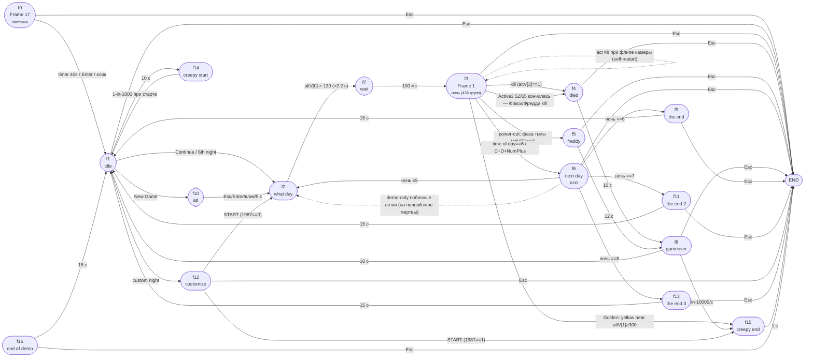

# Frame transitions & fades — FNAF1 (Five Nights at Freddy's)

Извлечено `ctfak-cpp` из `FiveNightsatFreddys.exe` (CF2.5, build R284, 17 кадров).
Источники: `TRANSITIONS.txt`, `ALL_EVENTS.txt`, `application.json`.

Переходы выполняются действиями объекта **`Game`** (ObjectType `-3`):

| Act # | Действие |
|---|---|
| `0` | Next frame |
| `2` | Jump to frame (literal, `value` = индекс кадра) |
| `4` | End application |
| `8` | Jump to frame (expression) |

> **Важно (v2.52):** в этом дампе действие **Jump to frame** печатает НЕВЕРНОЕ имя цели
> (экспортёр промахивается при подстановке имён) — но raw `value` верное: это
> индекс слота в сториборде. Исправленные цели указаны в рёбрах ниже и
> раскрыты подробно в `docs/DUMP_ATLAS.md` §1. Таймеры: сырые миллисекунды
> (аннотации `(~Ns)` в дампе атрибутированы на 50 Гц — читай милисекунды).

## Fade (переход-затемнение)

Fade — свойство кадра (блок `Transition`), модуль `STDT/FADE` (`cctrans.dll`), `flags=1` = fade-out.

| Кадр | Fade-in | Fade-out |
|---|---|---|
| 0 «Frame 17» | 1010 мс | 1010 мс |
| 2 «what day» | — | 1010 мс |
| 6 «next day» | 1010 мс | 900 мс |
| 8 «gameover» | 1010 мс | — |
| 9 «the end» | 2000 мс | 2000 мс |
| 10 «ad» | 2000 мс | 2000 мс |
| 11 «the end 2» | 2000 мс | 2000 мс |
| 12 «customize» | 560 мс | — |
| 13 «the end 3» | 2000 мс | 2000 мс |
| 16 «end of demo» | 1130 мс | 1010 мс |

Кадры без fade (жёсткий cut): `1 title`, `3 Frame 1`, `4 died`, `5 freddy`, `7 wait`, `14 creepy start`, `15 creepy end`.

## Граф переходов

## Полный список рёбер (кадр → цель с условием)

ВАЖНО (reading rule): в Events/*.txt действие `Jump to frame` ПЕЧАТАЕТ неверное имя кадра (сбитая таблица имён экспортёра) — истинная цель определяется raw-значением: это индекс слота в сториборде, и слот→кадр идёт так:
`0=Frame 1(офис) 1=died 2=freddy 3=next day 4=what day 5=title 6=wait 7=gameover 8=the end 3 9=the end 10=ad 11=customize 12=the end 2 13=creepy start 14=creepy end`. Проверено по известным веткам (6 AM → 3; Голден → 14 = creepy end с XSCREAM2 + End; power-out → 2 = freddy). Ниже — уже исправленные рёбра.

### f0 «Frame 17»
- timer 2000 мс → **Next** → f1 title
- Esc → **End**
- Enter / клик → **Next** → f1 title

### f1 «title»
- Esc → **End**
- `Active 6` altV[1]>20 ∧ altV[0]==1 (New Game) → **Jump v9** → f10 «ad» (газета-вакансия)
- `Active 6` altV[1]>20 ∧ altV[0]==2 (Continue) → **Next** → f2 what day
- `Active 6` altV[1]>20 ∧ altV[0]==3 (6th night) → **Next** → f2 what day
- `Active 6` altV[1]>20 ∧ altV[0]==4 (custom) → **Jump v11** → f12 customize
- одиночный ролл 1/1000 при старте кадра (group 62) → **Jump v13** → f14 creepy start (редчайший пасхал-экран титула)

### f2 «what day»
- `Active` altV[0]>130 (~2.2 c) → **Jump v6** → f7 wait

### f3 «Frame 1» (ночь / офис)
- Esc → **End**
- viewing>0 ∧ ≠33 → **Jump-expr** (objInfo 41 "screen follow 1") — self-restart кадра при флипе камеры; объектные ссылки это артефакт печати
- viewing==0 → **Jump-expr** (objInfo 55 "control room follow") — то же самое
- viewing==33 → **Jump-expr** (literal 0) — то же самое
- kill-струна Бонни/Чики: `Active 2` altV[3]==1 → **Next** → f4 died
- kill-анимы Фокси/Фредди закончились (Active3==52/65) → **Jump v1** → f4 died
- power-out: `Active 2` altV[6]==3 (полная тьма) → **Jump v2** → f5 «freddy» (тёмный kill)
- time of day == 6 → **Jump v3** → f6 next day
- дебаг: C+D+NumPlus → **Jump v3** → f6 next day
- Голден в офисе 300 тиков (~5 c): `yellow bear` altV[1]≥300 → **Jump v14** → f15 creepy end

### f4 «died»
- Esc → **End**
- timer 10000 → **Jump v7** → f8 gameover

### f5 «freddy»
- Esc → **End**
- timer 12000 → **Jump v7** → f8 gameover

### f6 «next day» (6:00)
- Esc → **End**
- altV[1]>200 ∧ night≤5 → **Jump v4** → f2 what day (карта следующей ночи)
- night==6 → **Jump v10** → f9 the end (чек за ночь 5)
- night==7 → **Jump v12** → f11 the end 2 (чек за ночь 6)
- night==8 → **Jump v8** → f13 the end 3 (кастом 20/20/20/20)
- demo-only: night==2 ∧ DEMO==1 → **Jump v4** → f2 what day; night>2 ∧ DEMO==1 → (ветка для демо-финала; в полной игре мертва)

### f7 «wait»
- timer 100 (или 1000) → **Jump v0** → f3 «Frame 1» (офис)

### f8 «gameover»
- Esc → **End**
- timer 10000 ∧ `random`≠1 → **Jump v5** → f1 title
- timer 1000 хан-тика: `random` := Random(10000)+1; попал 1 → **Jump v14** → f15 creepy end (яйцо 1/10000)

### f9 / f11 / f13 «the end»*
- Esc → **End**
- timer 15000 → **Jump v5** → f1 title

### f10 «ad»
- Esc / Enter / клик / timer 5000 → **Jump v4** → f2 what day

### f12 «customize» (1987 = счётчик кастом-ночи)
- Esc → **End**
- клик `Active 2` (START) ∧ 1987==0 → **Jump v4** → f2 what day (старт 7-й ночи)
- клик `Active 2` ∧ 1987==1 → **Jump v14** → f15 creepy end (1987 закрывает игру скримером)

### f14 «creepy start»
- timer 10000 → **Jump v5** → f1 title (9500 мс — появляются глаза)

### f15 «creepy end»
- timer 1000 → **End** (старт кадра: стоп-все + XSCREAM2 ch29)

### f16 «end of demo»
- Esc → **End**
- timer 15000 → **Jump v5** → f1 title