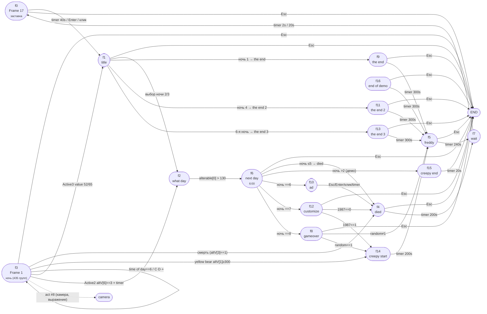

# Frame transitions & fades — FNAF1 (Five Nights at Freddy's)

Извлечено `ctfak-cpp` из `FiveNightsatFreddys.exe` (CF2.5, build R284, 17 кадров).
Источники: `TRANSITIONS.txt`, `ALL_EVENTS.txt`, `application.json`.

Переходы выполняются действиями объекта **`Game`** (ObjectType `-3`):

| Act # | Действие |
|---|---|
| `0` | Next frame |
| `2` | Jump to frame (literal, `value` = индекс кадра) |
| `4` | End application |
| `8` | Jump to frame (expression) |

## Fade (переход-затемнение)

Fade — свойство кадра (блок `Transition`), модуль `STDT/FADE` (`cctrans.dll`), `flags=1` = fade-out.

| Кадр | Fade-in | Fade-out |
|---|---|---|
| 0 «Frame 17» | 1010 мс | 1010 мс |
| 2 «what day» | — | 1010 мс |
| 6 «next day» | 1010 мс | 900 мс |
| 8 «gameover» | 1010 мс | — |
| 9 «the end» | 2000 мс | 2000 мс |
| 10 «ad» | 2000 мс | 2000 мс |
| 11 «the end 2» | 2000 мс | 2000 мс |
| 12 «customize» | 560 мс | — |
| 13 «the end 3» | 2000 мс | 2000 мс |
| 16 «end of demo» | 1130 мс | 1010 мс |

Кадры без fade (жёсткий cut): `1 title`, `3 Frame 1`, `4 died`, `5 freddy`, `7 wait`, `14 creepy start`, `15 creepy end`.

## Граф переходов

## Полный список рёбер (кадр → цель с условием)

### f0 «Frame 17»
- timer 40s → **Next** → f1 title
- Esc → **End**
- Enter / клик → **Next** → f1 title

### f1 «title»
- Esc → **End**
- `Active 6` altV[1]>20 ∧ altV[0]==1 → **Jump** → f9 the end
- `Active 6` altV[1]>20 ∧ altV[0]∈{2,3} → **Next** → f2 what day
- `Active 6` altV[1]>20 ∧ altV[0]==4 → **Jump** → f11 the end 2
- Group 62 (скрытое меню 6-й ночи) → **Jump** → f13 the end 3

### f2 «what day»
- `Active` altV[0]>130 → **Jump** → f6 next day

### f3 «Frame 1» (ночь)
- Esc → **End**
- viewing>0 ∧ ≠33 → **Jump (expr)** → `Object(41).val11` (камера)
- viewing==0 → **Jump (expr)** → `Object(55).val11`
- viewing==33 → **Jump (expr)** → 0
- `Active 2` altV[3]==1 → **Next** → f4 died
- `Active 2` altV[6]==3 ∧ timer 40s → **Jump** → f2 what day
- `Active 2` altV[6]==3 ∧ timer 400s → **Jump** → f2 what day
- time of day == 6 → **Jump** → f3 (self)
- клавиши C / D / NumPlus → **Jump** → f3 (self)
- `Active 3` value 52 / 65 → **Jump** → f1 title
- `yellow bear` altV[1]≥300 → **Jump** → f14 creepy start

### f4 «died»
- Esc → **End**
- timer 200s → **Jump** → f7 wait

### f5 «freddy»
- Esc → **End**
- timer 240s → **Jump** → f7 wait

### f6 «next day» (6:00)
- Esc → **End**
- altV[1]>200 ∧ night≤5 ∧ DEMO==0 → **Jump** → f4 died
- altV[1]>200 ∧ night==2 ∧ DEMO==1 → **Jump** → f4 died
- altV[1]>200 ∧ night>2 ∧ DEMO==1 → **Jump** → f15 creepy end
- night==6 → **Jump** → f10 ad
- night==7 → **Jump** → f12 customize
- night==8 → **Jump** → f8 gameover

### f7 «wait»
- timer 2s / 20s → **Jump** → f0 Frame 17

### f8 «gameover»
- Esc → **End**
- timer 200s ∧ `random`≠1 → **Jump** → f5 freddy
- timer 200s ∧ `random`==1 → **Jump** → f14 creepy start

### f9 / f11 / f13 «the end»
- Esc → **End**
- timer 300s → **Jump** → f5 freddy

### f10 «ad»
- Esc / Enter / клик / timer 100s → **Jump** → f4 died

### f12 «customize» (1987 = счётчик кастом-ночи 1987)
- Esc → **End**
- клик `Active 2` ∧ 1987==0 → **Jump** → f4 died
- клик `Active 2` ∧ 1987==1 → **Jump** → f14 creepy start

### f14 «creepy start»
- timer 200s → **Jump** → f5 freddy

### f15 «creepy end»
- timer 20s → **End**

### f16 «end of demo»
- Esc → **End**
- timer 300s → **Jump** → f5 freddy